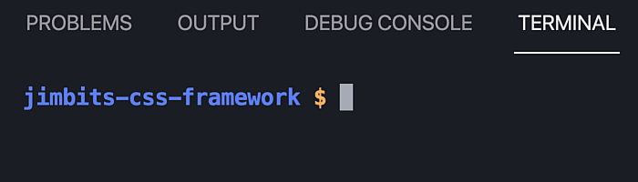

# SASS Basics

 


## 🎫 Boarding Check List

#### 1. Check For Node Version
1. Open VSCode command line. View > Terminal
1. In the command line issue the following terminal command.  

     


#### 2. Check For NPM Version
1. Open VSCode command line. View > Terminal
1. In the command line issue the following terminal command.  

      


#### 3. Install - Dart SASS Compiler Extension 
1. Install the [Dart SASS Compiler Extension](https://marketplace.visualstudio.com/items?itemName=codelios.dartsass)
1. If you have the live sass plugin installed remove it.  

    


#### 4. Check To Make Sure You Have SASS installed. (dartsass not libsass)
Open the terminal and type the following command. If you do not see a sass version you will need to install it.

```
sass -v
```   
Install DartSass

```
npm
npm install -g sass

```

 #### 3. Configure The Dart SASS Compiler Extension 
1. Open you settings Mange > Settings
1. Search for DartSass
1. Select the extension
1. Change the target directory setting to the path where you want to 
   output your css.  

     
        


### __Variables__
```scss
$grey-50: #f8fafc;
$grey-100:#e2e8f0;
$grey-200: #cbd5e1;
$grey-400: #94a3b8;
$grey-500: #64748b;
$grey-600: #475569;
$grey-700: #334155;
$grey-800: #1e293b;
$grey-900: #0f172a;
body {
    background-color: $grey-100;
}
```

### __Nesting__
```scss
    nav {
        ul {
            margin: 0;
            padding: 0;
            list-style: none;
        }

        li { 
            display: inline-block; 
        }

        a {
            display: block;
            padding: 6px 12px;
            text-decoration: none;
        }

    }
```
 


### __Partials__
You can create partial Sass files that contain little snippets of CSS that you can include in other Sass files. This is a great way to modularize your CSS and help keep things easier to maintain. A partial is a Sass file named with a leading underscore. You might name it something like _partial.scss. The underscore lets Sass know that the file is only a partial file and that it should not be generated into a CSS file. Sass partials are used with the @use rule.
```scss
    nav {
        ul {
            margin: 0;
            padding: 0;
            list-style: none;
        }

        li { 
            display: inline-block; 
        }

        a {
            display: block;
            padding: 6px 12px;
            text-decoration: none;
        }

    }
```
 

 ### __@use__

 The @use rule loads mixins, functions, and variables from other Sass stylesheets, and combines CSS from multiple stylesheets together. Stylesheets loaded by @use are called "modules". Sass also provides built-in modules full of useful functions.

<br>

create scss in different files.

 ```scss
//  _code-syntax.scss
    code {
     padding: .25em;
     line-height: 0;
    }
 ```

<br>

create scss in different files.

 ```scss
//  _components.scss
ul, ol {
  text-align: left;

  & & {
    padding: {
      bottom: 0;
      left: 0;
    }
  }
}
 ```
<br>
Combine the partials/modules into your styles.scss file to include them.

 ```scss
 // styles.scss
@use 'foundation/code';
@use 'foundation/lists';
```

### __Extend/Inheritance__
```scss
%button {
    border: none;
    background-color: transparent;
    border-radius: 3px;
    padding: 0.5rem 1.5rem;
    color: $grey-600;
    box-shadow: 0 0 2px 0 $grey-400;
  }
  
  button{
      @extend %button; 
  }
  
```