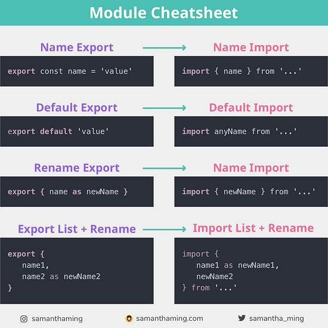

# ES6 Modules

## **Resources** :

### Video

- [Modules by Web Dev](https://www.youtube.com/watch?v=cRHQNNcYf6s) runtime 8 min 
- [Modules by FireShip](https://www.youtube.com/watch?v=qgRUr-YUk1Q) runtime 2 min

----

### Text

- [Modules Beginner Guide](https://www.freecodecamp.org/news/javascript-modules-beginners-guide)
- [JavaScript Modules – Explained with Examples](https://www.freecodecamp.org/news/javascript-modules-explained-with-examples/) 
- [Modules Cheatsheet](https://www.samanthaming.com/tidbits/79-module-cheatsheet/)
- [Mocules Cartoon Deep Dive](https://hacks.mozilla.org/2018/03/es-modules-a-cartoon-deep-dive/)

----

