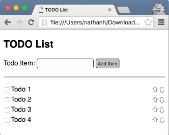
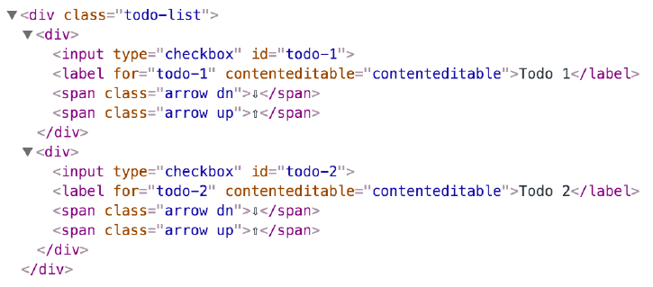

# DOM Manipulation

- [Document Object Model (DOM)](https://developer.mozilla.org/en-US/docs/Web/API/Document_Object_Model)

## DOM API

The Document Object Model (DOM) is a means of viewing a web document as a tree structure with a root from which all elements in the document can be retrieved. The first specification for this model was released by the W3C as DOM Level 1 in 1998. It is from this early version that laid the ground work (APIs, schema, etc.) for Level 2 (released 2000) and the current specification Level 3 (released 2004).

DOM Level 2 added support for advanced event handling, element access, and CSS. DOM Level 3 improved upon Level 2 features and added support for [XPath](http://www.w3.org/TR/xpath/).

## DOM Core vs DOM HTML

The DOM (as far as web browsers are concerned) is split into two distinct yet overlapping Application Programming Interfaces (APIs). The first is the Core API, which is used to define general XML document element access and manipulation. The second is the HTML API, which is used to define HTML specific document element access and manipulation. Many parts of the two specifications overlap, that is, several methods that are defined within one of the APIs can be found in the other. The good news is that you don't have to be aware of which one you are using; the browser will automatically utilize the method/property from the appropriate API when script code is executed.

## Why Two APIs?

XHTML documents are specific to the web and web browsers, and before the DOM specification was agreed upon, browser vendors had already included a similar method of accessing these documents called the Browser Object Model (BOM). In order to maintain backwards compatibility with existing scripts, the DOM HTML API was defined.

## Todo List Application

The DOM can be a pleasant thing to work once you are familiar with the application programming interface (API) it exposes. Updating the Todo list example you've previously worked on to allow for moving elements around is a good way to get more familiar with the power of the DOM.

> Figure 1. Todo list application


The script needs to be updated so that it displays up/down controls for each todo item added. Use what you have learned about the DOM API to update the parent element for the document fragment for a single todo item (i.e. the div) with the following two elements:

> Example 1. Elements to be added to the todo item document fragment

```html
<span class="arrow dn">\u21e9</span>
<span class="arrow up">\u21e7</span>
```

> Example 2. Unicode variables for you to use in your JavaScript

```js
var dn = '\u21e9'; // Unicode value of down arrow
var up = '\u21e7'; // Unicode value of up arrow
```

> Figure 2. Updated todo items displayed



You can read more about Unicode block arrow values [here](http://www.fileformat.info/info/unicode/block/arrows/utf8test.htm).

### Parent and Sibling Relationships

The new arrows have been added as a means to allow the user the ability to prioritize items in their list. Now, items can be moved either up or down as is desired simply by clicking the appropriate arrow… well not quite yet, we need to add some code!

It is necessary to understand the relationships between elements in order for us to make this work. Elements have relationships much like the family relationships that you are used to. For example, an element may have a parent (the element in which it is contained), it may have a child (the element(s) contained within itself), and it may have siblings (other elements that share the same parent). The following shows a sample of the document we are interested in:

> Figure 3. Elements involved in our todo list



As you can see, each todo item displayed shares the same parent (the div.todo-list element), which makes them siblings. The exact same thing can be said for the span.arrow elements within their respective parent elements (which is simply a div). Therefore, each parent element (in this case) has several child elements nested within it. We can take advantage of these relationships to implement the up/down functionality for the application.

Before coding, think about what should happen when either of the arrows is clicked. For example, let's say the down arrow is clicked… what should happen? Ideally, the todo item that contains the down arrow will be moved to the position immediately after its next sibling. The opposite is true for clicking the up arrow (i.e. move to a position immediately before its previous sibling).

***Note**: You should take some time to draw this out on a piece of paper and make sure you fully understand the relationships between these elements.*

### DOM API Methods

The DOM exposes many methods for working with it (as you have seen in the required readings). To accomplish the task in front of us, we need to identify the methods for traversing the DOM tree and manipulating nodes in it that will be useful:

- insertBefore() – inserts a node immediately before another
- nextElementSibling – reference to the next immediate sibling of the referenced node
- previousElementSibling – reference to the previous immediate sibling of the referenced node
- parentNode – reference to the parent node of the referenced node

### Putting it Together

First things first, an event listener needs to be added to react to the clicking of arrows. This can be applied to the parent of all todo items (i.e. div.todo-list):

> Example 3. A function to update the current slide image

```js
document.querySelector('.todo-list').addEventListener('click', function (evt) {
  // check for click on an arrow
  if (evt.target.classList.contains('arrow')) {
    // identify the type of arrow (i.e. down or up)
    if (evt.target.classList.contains('dn')) {
      console.log('down...');
    } else if (evt.target.classList.contains('up')) {
      console.log('up...');
    }
  }
});
```

That should be enough to get your handler implemented. Now we can explore the relationships between nodes. Update the log statement to display the parent of the event target:

> Example 4. Update for the down arrow log statement

```js
...
console.log(evt.target.parentNode + ' down...');
...
```

You should see that the log statement now includes [object HTMLDivElement] in the output, which is the parent of the span we clicked on!

**Note**: This would be a good time to experiment with different node properties and methods to see what else you can find.

Okay, now for the finale. Clicking the arrow shouldn't just log out the parent node but should actually move it to a new location in the DOM tree (assuming it's not the first item moved up or the last item moved down). This is where `insertBefore()` comes in. Notice there is no insertAfter(), so we will have to think of how we get this to work using insertBefore().

The insertBefore() function takes two parameters, the first is the node to move and second is the node we would like to insert before. So, when moving an item down, we need to find the parent (done above) and insert it before its previous sibling. The trick here is that the insertBefore() call must be made from the parent of the todo items… the div.todo-list element! Putting it together yields the following:

> Example 5. Almost done, moving up works great… down has a hiccup

```js
document.querySelector('.todo-list').addEventListener('click', function (evt) {
  // check for click on an arrow
  var targetTodo = evt.target.parentNode;
  var todoList = targetTodo.parentNode;
  var siblingTodo;
  if (evt.target.classList.contains('arrow')) {
    // identify the type of arrow (i.e. down or up)
    if (evt.target.classList.contains('dn')) {
      siblingTodo = targetTodo.nextElementSibling;
      // insert the sibling before the target
      todoList.insertBefore(siblingTodo, targetTodo);
    } else if (evt.target.classList.contains('up')) {
      siblingTodo = targetTodo.previousElementSibling;
      // insert the sibling before the target
      todoList.insertBefore(targetTodo, siblingTodo);
    }
  }
});
```

### Knowing the API

Moving the first item up results in it being appended to the end of the list so to speak. But try moving the first item down and there's a problem. To determine why, you must understand the API specifications. Giving [them](https://developer.mozilla.org/en-US/docs/Web/API/Node/insertBefore) a quick read reveals that specifying null (the value returned for the previous sibling when there is none) for the reference node simply results in the appending operation we've observed. However, specifying null for the target node (the node we want to move) breaks the function call and there is an error. What we need to do here is think of what the desired behavior should be. Either the user has the ability to make items 'wrap around' the list (from beginning to end and vice versa) or they should not be able to do this. The option is up to, but requires about the same amount of
work either way. Update your example so that one of these options is implemented.

### Why not just use innerHTML?

Some of you may be thinking "... this seems like a lot of work to just get some text to display in the browser, why not just use innerHTML and be done with it?"

While innerHTML can be used to quickly add elements to the page, it becomes quite timeconsuming/difficult to locate elements within the HTML string. Using the W3C DOM methods will allow for (in some cases as has been shown in this exercise) quicker and more direct access to a specific element that has been added to a page than innerHTML. That being said, each has an appropriate time and place when it should be used; typically, this is up to the developer.

